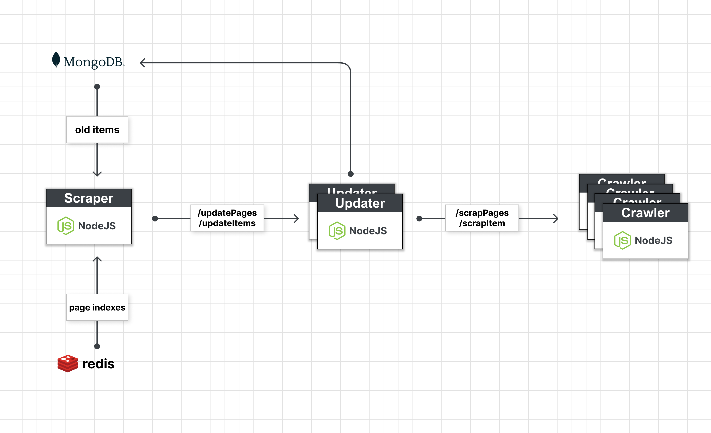
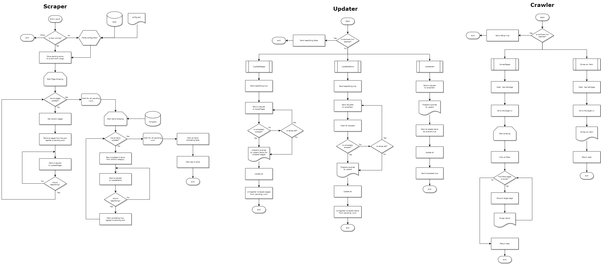

개인프로젝트를 위해 만든 스크래퍼이며, 현재는 다나와의 부품을 스크래핑하지만 적절한 구조 변경을 통해 다른 사이트에도 활용 가능합니다.

### Scraping Structure

### Scraping Flow Chart

Seperation of Concern을 위해 프로세스를 나누었고, 최대한 하나의 역할을 수행하도록 한다.

- [Updater](https://github.com/SwimmingPolar/electrokerot-msa-db-updater)
- [Crawler](https://github.com/SwimmingPolar/electrokerot-crawler)

### Scraper

단일 프로세스 엔트리 포인트, json 설정 파일을 파싱하여 스크래핑을 준비한다.

### Updater

Scraper에서 받은 요청을 Crawler로 보내고 응답을 가지고 db를 업데이트 한다.

### Crawler

받은 요청에 따라 스크래핑 후 데이터를 재단하여 리턴한다.

### 스크래핑 속도 조절

- Updater 인스턴스 수 - 한 번의 트랜잭션으로 업데이트되는 도큐먼트 조절
- Crawler 인스턴스 수 - 스크래핑 속도 조절

Updater와 Crawler 모두 request limiter를 통해 한 번에 처리할 수 있는 요청의 양을 조절한다.

- Updater: (default: 10)
- Crawler (default: 3)

스크래핑을 하는 Crawler의 request limiter를 올릴 경우 ip차단의 가능성이 있음

Updater의 수가 많을 수록 업데이트 속도가 빨라지지만, Crawler의 request limiter(default: 3) 때문에 병목이 있음으로, Updater와 Crawler의 전체적인 밸런스가 중요하다. 토르 네트워크를 우회한 요청의 경우, http 요청 완료에 요청 당 평균 1.5분의 시간이 소요되고 전체 처리 과정의 오버헤드를 감안하여 rest api 요청 처리 시간을 1.75분으로 산정한다. 이를 기준으로 노드 인스턴스의 수를 적절하게 조절하면 되겠다.

## 로컬 환경에서 실행 (개발 환경)

MongoDB와 Redis가 설치되어 있어야 한다. Scraper, Updater, Crawler 실행 순서는 상관 없다.

`npm run start`

Redis의 경우, 보안 취약점 때문에 기본적인 패스워드가 없을 경우, 실행 후 단시간 내 멀웨어에 감염되기 때문에 패스워드 보안을 설정해야 한다.

`redis-server —requirepass electrokerot`

어떤 경로로 감염되는지는 모르겠지만 추후 사용하는 도커 이미지들도 권한상승(privilege escalation) 공격에 잠재적으로 노출될 위험이 있는 거 같다.

[https://www.trendmicro.com/en_us/research/20/d/exposed-redis-instances-abused-for-remote-code-execution-cryptocurrency-mining.html](https://www.trendmicro.com/en_us/research/20/d/exposed-redis-instances-abused-for-remote-code-execution-cryptocurrency-mining.html)

## 도커 환경에서 실행 (실제 스크래핑 환경)

배포 환경에서는 (NODE_ENV=production) 프록시가 없다면 실행되지 않는다. scrap-service 폴더 안의 .env 파일에 있는 환경변수를 적절하게 채워줘야 한다.

명령어 실행위치: electrokerot-scraper/scrap-service/

### 로컬 컨테이너 레지스트리 생성

도커 스웜을 사용하기 위해선 레지스트리가 필요함으로, 로컬에 생성한다.

`docker create service --name registry --publish published=5000,target=5000 registry:2`

### 볼륨 생성

redis 데이터가 보존되며, 서비스 재실행시 볼륨이나 redis를 초기화 해주어야 한다.

`docker create volume electrokerot-redis`

docker-compose.yml 파일이 있는 위치에서 실행해야 한다.

### 도커 이미지 빌드

`docker compose build`

### 도커 이미지를 로컬 레지스트리로 푸쉬

`docker compose push`

### 도커 스웜 실행

`docker swarm init`

`docker stack deploy -c docker-compose.yml collector`

스웜이 실행 된 후, 스크래핑 속도를 올리기 위해 노드 인스턴스 수를 순서에 맞게 스케일 아웃한다.

`docker service scale collector_tor=15`

`docker service scale collector_crawler=35`

`docker service scale collector_updater=15`

docker compose 3.0 이상에서 서비스 시작 순서를 보장하는 오케스트레이션 기능이 없기 때문에 수십개의 replicas를 한 번에 시작하면 서비스가 정상적으로 시작되지 않는다. 때문에 적은 수의 인스턴스를 정상적으로 올린 뒤에 스케일링 해야한다.

리눅스 환경이나 wsl bash 환경에서 다음 명령어로 서비스 상태를 확인한다.

전체 서비스 상태 확인

`watch -n 1 docker service ls`

`docker service logs collector_scraper`

`docker service logs collector_updater`

`docker service logs collector_crawler`

## 오류

토르를 우회하는 요청이다보니 다양한 네트워크 오류가 발생한다. 아직 명확한 이유는 모르겠으며, 한 번 스크래핑 후 남은 목록을 다시 스크래핑하는 방법 밖에는 없어보인다. 네트워크 오류 외 아직 여러 버그가 존재함

## 실행 환경 사양

3.6Ghz 8코어 16쓰레드, 32GB 메모리 환경에서

- 15개의 Updater
- 35개의 Crawler
- 10개의 Tor

인스턴스들을 올렸을 경우, 종종 다운된다. 연산이 많지 않음에도 이런 건 노드들 간의 sleep 없는 restapi 통신 (cpu)이나 인스턴스 수(memory) 자체가 많아서 이런 현상을 보이는 거 같다. 환경에 따라 적절하게 재단해서 사용해야 해야함

## 속도

1개의 요청은 1개의 페이지나 1개의 ajax요청으로 생각하고, 7500개의 요청을 완료하는데보 대략 2~3 시간 정도 걸린다.

## Updater에서 Page Update 시, 업데이트하는 항목

### items collection

| field     | type      |
| --------- | --------- |
| \_id      | object id |
| pcode     | string    |
| name      | string    |
| tags      | array     |
| category  | string    |
| updatedAt | date      |

### category collection

| field     | type      |
| --------- | --------- |
| \_id      | object id |
| pcode     | string    |
| name      | string    |
| tag       | string    |
| variants  | array     |
| sortOrder | string    |
| stock     | boolean   |
| isVariant | boolean   |

## Updater에서 Item 업데이트 시, 업데이트하는 항목

### category collection

| field     | type   |
| --------- | ------ |
| vendors   | array  |
| details   | object |
| updatedAt | date   |
